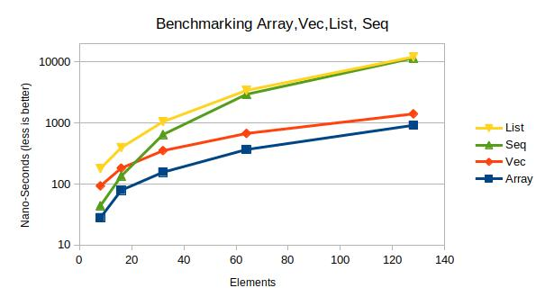

# seq module

The module `seq` provides the lightweight, generic sequence container `Seq` for unmovable data.

The container `Seq` is linking data of hierarchical function-scopes on top of each other,
forming sequences. A sequence can be embedded into the program during compile time.

Initially a sequence is empty. A longer sequence is constructed (see `Seg::ConsRef`) attaching a
new _head_ to the existing sequence, representing the _tail_.  The _head_ element has a shorter
lifetime, than all elements of the _tail_.

Multiple sequences may share the same _tail_, permitting memory-efficient organisation of
hierarchical data.

The associated methods `Seq::head` and `Seq::tail` have been defined for convenience reasons only.
The construction and deconstruction of a sequence is realized by the algebraic data-types of Rust
solely.

## Usage

Put this in your Cargo.toml:
```toml
## Cargo.toml file
[dependencies]
seq = "0.6"
```

The "default" usage of this type as a queue is to use `Empty` or `ConsRef` to construct a
queue, and `head` and `tail` to deconstruct a queue into head and remaining
tail of a sequence.

### Lite-Seq - Without dynamic memory
If enabling the feature 'lite-seq', the support for the box-ed elements `Seq::ConsOwn(..)` is removed, 
limiting the seq-containers to static elements or elements in lexical scope. This feature might
be interesting for `no_std` build-environments, without support for dynamic memory or `malloc`.

```
[dependencies.seq]
features = ["lite-seq"]
version = "^0.6"
git = "https://github.com/frehberg/seq-rs.git"
```


```rust
pub enum Seq<'a, T: 'a> {
    Empty,
    ConsRef(T, &'a Seq<'a, T>),
    ConsOwn(T, Box<Seq<'a, T>>),
}
```

## Examples

Constructing two sequences seq1 as `[1,0]` and seq2 as `[2,1,0]`, sharing data with `seq1`
```rust
// constructing the sequence 'seq1'
const seq1: Seq<i32> = Seq::ConsRef(1, &Seq::ConsRef(0, &Seq::Empty));

// construction the sequence 'seq2' sharing data with 'seq1'
const seq2: Seq<i32> = Seq::ConsRef(2, &seq1);
```
Deconstructing a sequence  into the `head` and `tail`
```rust
fn deconstruct<'a>(seq: &'a Seq<i32>) {
   let head = seq.head().unwrap());
   let tail = seq.tail().unwrap();
   // more code here
   ///
}
```
Extend an existing sequence. Note the lifetime of the return type matches the one of the tail.
```rust
fn extend<'a>(head: i32, tail: &'a Seq<i32>) -> Seq<'a, i32> {
   return Seq::ConsRef(head, tail);
}
```
Extend an existing sequence with dynamic element residing in heap-memory
```rust
fn extend_boxed<'a>(head: i32, tail: &'a Seq<i32>) -> Box<Seq<'a, i32>> {
   return Box::new(Seq::ConsRef(head, tail));
}
```
Iterate a sequence
```rust
fn sum_up(seq: &Seq<i32>) -> i32 {
   return seq.into_iter().fold(0, |x, y| x + y);
}
```

## Memory layout

The following image illustrates the sequences `s`, `t`, `u`. The sequence `s` is a sub-sequence of `t`, and `t` 
being a sub-sequence of `u`; each one accessible in its function context only. One can create a new sequence containing additional elements, wihtout the need to create a copy of all elements.


For use-cases where a sub-routine/expression shall return a temporary extended sequence, it is possible to construct new 
sequences using elements in heap-memory. In this case these heap-elements are boxed/owned.


## Benchmarks
The data structure `Seq` implements a linked list. In terms of performance it cannot compete with a native
array. But, `Seq` ranks between the containers `Vec` and `LinkedList`.

The benchmark is a memory-intensive, recursive function call and benefits from consecutive memory;
each recursive function-call a new integer element is appended and an iterator is cumulating all elements.

As the benchmark-chart demonstrates, the container `Seq` performs better than `Vec` and`LinkedList` for up to
`N=16` elements; and even shows better performance than `LinkedList`, and lower variants up to a
certain bound. The benchmark is performed for N= 8, 16, 32, 64, 128, 256, 512.

The test-environment is using a Lenovo-x260 laptop using `rustc 1.27.0-nightly (bd40cbbe1 2018-04-14)`.

```> cargo bench --features benchmark```

```commandline
test benchmark::bench_array_008  ... bench:          28 ns/iter (+/- 2)
test benchmark::bench_array_016  ... bench:          70 ns/iter (+/- 0)
test benchmark::bench_array_032  ... bench:         156 ns/iter (+/- 7)
test benchmark::bench_array_064  ... bench:         368 ns/iter (+/- 10)
test benchmark::bench_array_128  ... bench:         920 ns/iter (+/- 39)
test benchmark::bench_array_256  ... bench:       2,639 ns/iter (+/- 138)
test benchmark::bench_array_512  ... bench:       8,355 ns/iter (+/- 263)
test benchmark::bench_list_008   ... bench:         179 ns/iter (+/- 8)
test benchmark::bench_list_016   ... bench:         396 ns/iter (+/- 17)
test benchmark::bench_list_032   ... bench:       1,053 ns/iter (+/- 58)
test benchmark::bench_list_064   ... bench:       3,433 ns/iter (+/- 173)
test benchmark::bench_list_128   ... bench:      12,158 ns/iter (+/- 276)
test benchmark::bench_list_256   ... bench:      48,419 ns/iter (+/- 585)
test benchmark::bench_list_512   ... bench:     186,391 ns/iter (+/- 4,401)
test benchmark::bench_seq_008    ... bench:          44 ns/iter (+/- 1)
test benchmark::bench_seq_016    ... bench:         135 ns/iter (+/- 10)
test benchmark::bench_seq_032    ... bench:         648 ns/iter (+/- 41)
test benchmark::bench_seq_064    ... bench:       2,964 ns/iter (+/- 75)
test benchmark::bench_seq_128    ... bench:      11,654 ns/iter (+/- 278)
test benchmark::bench_seq_256    ... bench:      44,908 ns/iter (+/- 570)
test benchmark::bench_seq_512    ... bench:     175,569 ns/iter (+/- 4,009)
test benchmark::bench_vec_008    ... bench:          93 ns/iter (+/- 4)
test benchmark::bench_vec_016    ... bench:         182 ns/iter (+/- 4)
test benchmark::bench_vec_032    ... bench:         353 ns/iter (+/- 13)
test benchmark::bench_vec_064    ... bench:         676 ns/iter (+/- 8)
test benchmark::bench_vec_128    ... bench:       1,415 ns/iter (+/- 78)
test benchmark::bench_vec_256    ... bench:       3,485 ns/iter (+/- 212)
test benchmark::bench_vec_512    ... bench:      11,261 ns/iter (+/- 425)
```



Every element of `Seq` is causing overhead of ca 16 bytes for the discriminator, and the reference
to the tail.

## Conclusion
These benchmarks show, the collection `Seq` shows better performance than `Vec` for 16 elements or less, and even
better performance than `LinkedList` for all test-cases up to 512 elements. In this range `Seq` benefits from stack-memory.
When `N>32` the performance drops, probably caused by page-faults and the need to request additional stack memory-pages from OS, getting similar to the performance of linked-lists.
